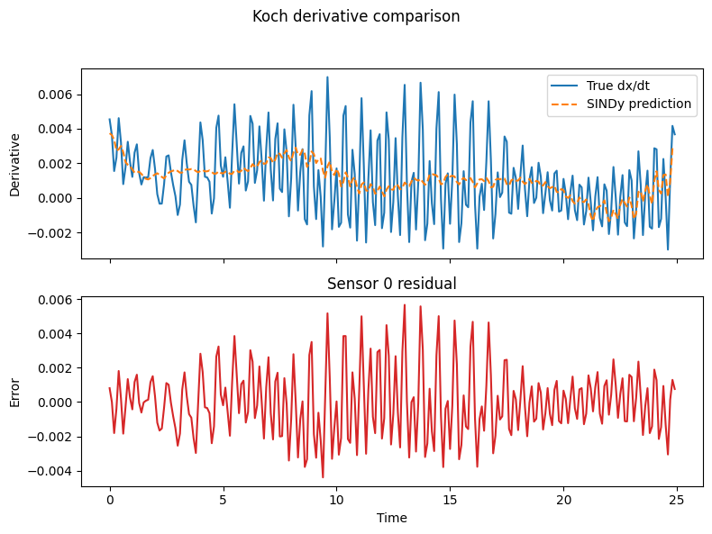

# Files for Submission

This directory contains the implementation and data files for the RDE-DA-SHRED project, which focuses on rotating detonation engine (RDE) simulation and data-driven modeling.

## Contents

### Main Implementation Files

- **`Cheap2Rich.py`** - Core implementation of the data-driven model that transforms low-fidelity simulations to high-fidelity predictions
- **`baselines_for_results.ipynb`** - Jupyter notebook containing baseline comparisons and results visualization

### Data Files

- **`high_fidelity_1d_dataset.npy`** - High-fidelity simulation dataset (1D)
- **`Kochs_model_dataset.npy`** - Raw dataset from Koch's model

- **`high_fidelity_sim_processed.npy`** - Processed high-fidelity simulation data
- **`Koch_model_processed.npy`** - Processed data from Koch's model

### Configuration

- **`requirements.txt`** - Python package dependencies required to run the code

### Koch Model Data Generation

The `Koch_model_data_generation/` subdirectory contains utilities for generating data with Koch's model :

- **`euler_1D_py.py`** - 1D Euler equation solver implementation
- **`rde1d_3_waves.py`** - RDE simulation with 3-wave configuration
- **`how_to_generate_data.md`** - Instructions for generating new simulation data

the output of `rde1d_3_waves.py` should be a `Kochs_model_dataset.npy` file which weighs over 160MB (hence it is not attached to the submission). It is preprocessed in the first cells of the `baselines_for_results.ipynb` notebook, so running the notebook first is recommended. Alternatively, the preprocessed datasets from both high fidelity and low fidelity simulations are attached and can be found in **`high_fidelity_sim_processed.npy`**, **`Koch_model_processed.npy`** and used for baselines and the Cheap2Rich model.

## Getting Started

1. Install dependencies (the code has been tested with Python 3.13.7):
    ```bash
    pip install -r requirements.txt
    ```
2. (Optional) Generate data from Koch's model using scripts in `Koch_model_data_generation/`. Follow the instructions regarding Clawpack and `euler_1D_py.py`. 

3. (Optional, requires 2.) Review the baseline results notebook to understand the approach

4. Run the main model using `Cheap2Rich.py`
## SINDy physics discovery

The `sindy-discovery` branch runs PySINDy on the Koch simulation, the high-fidelity measurement, and their residual to recover sparse polynomial equations in the chosen sensor coordinates. Each run saves a derivative comparison plot (`reports/sindy_<Label>.png`) so you can visually compare the predicted derivatives to the measured value for the first sensor.


