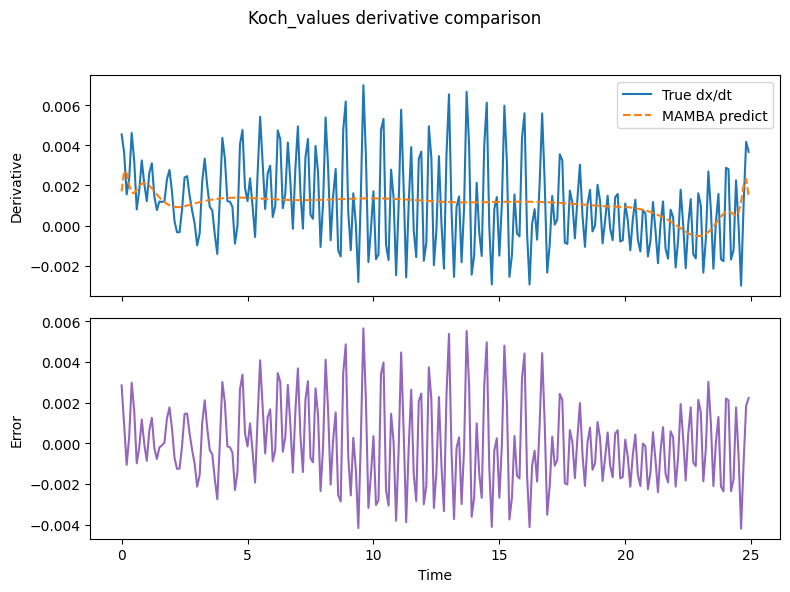
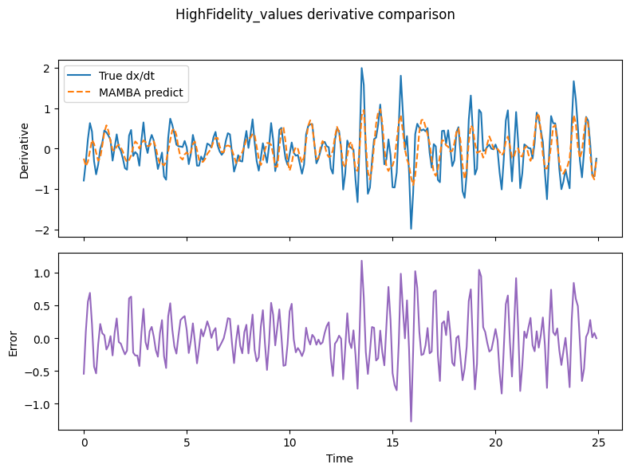

# MAMBA-inspired Multi-scale Discovery

Sensor indices: [0, 25, 50, 75, 99]

## Koch (cwt+values)
- Feature count: 25
- Derivative MSE: 1.375365e-05
- Score: 0.3692
- Top features: ['x75_cwt_w16', 'x0_cwt_w16', 'x99_cwt_w16', 'x50_cwt_w16', 'u75']

## Koch (cwt-only)
- Feature count: 20
- Derivative MSE: 1.395940e-05
- Score: 0.3597
- Top features: ['x75_cwt_w16', 'x0_cwt_w16', 'x99_cwt_w16', 'x50_cwt_w16', 'x75_cwt_w8']

## HighFidelity (cwt+values)
- Feature count: 25
- Derivative MSE: 1.514492e-01
- Score: 0.2883
- Top features: ['x99_cwt_w2', 'u99', 'x0_cwt_w2', 'u0', 'x25_cwt_w2']

## HighFidelity (cwt-only)
- Feature count: 20
- Derivative MSE: 1.547577e-01
- Score: 0.2728
- Top features: ['x99_cwt_w2', 'x0_cwt_w2', 'x25_cwt_w2', 'x50_cwt_w2', 'x0_cwt_w4']

