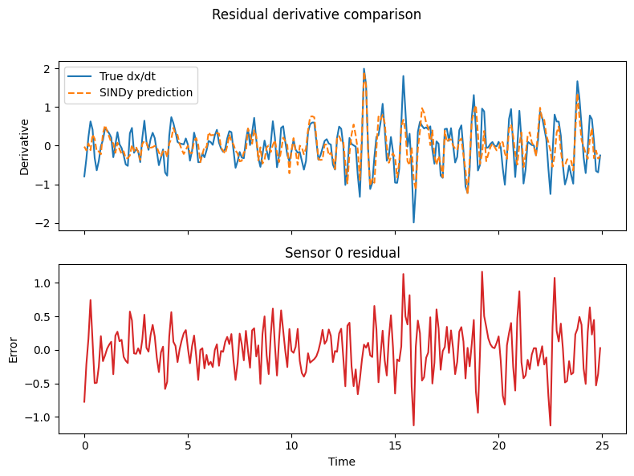

# SINDy Discovery Report

Sensor indices: [0, 25, 50, 75, 99]

## Koch
- Derivative MSE: 7.893825e-06
- Score (R²-like): 0.6379
- Number of active terms: 116

## HighFidelity
- Derivative MSE: 1.299322e-01
- Score (R²-like): 0.3894
- Number of active terms: 280

## Residual
- Derivative MSE: 1.301772e-01
- Score (R²-like): 0.3886
- Number of active terms: 278

